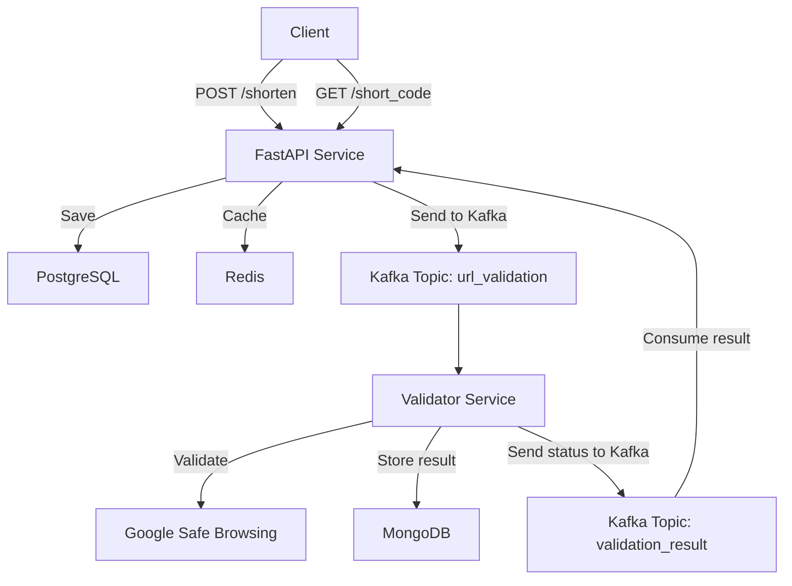

# 🔗 URL Shortener API

A scalable, event-driven URL shortening service inspired by Bit.ly. Built with a modern backend stack and designed for performance, reliability, and extensibility.

---

## 📌 Description

This project provides a backend service for shortening long URLs and tracking their usage statistics. It is designed with production-grade technologies and patterns, including **asynchronous processing**, **event streaming**, **microservices**, and **URL safety validation** using Google's Safe Browsing API.

---

## 🚀 Features

### ⚙️ Core Functionality (Backend)
- `POST /shorten/` – Shorten a long URL.
- `GET /go/{short_code}/` – Redirect to the original URL.
- `GET /stats/{short_code}/` – Return usage statistics (click count).
- 🔐 Asynchronous **URL validation** through Kafka + Google Safe Browsing.
- ⚠️ New URLs are **inactive by default** until validated as safe.

### 🧠 Architecture Highlights
- **Asynchronous FastAPI backend** with `asyncpg` and SQLAlchemy.
- **Redis caching** to accelerate repeated URL lookups and reduce DB load.
- **Kafka-based microservices** for decoupled validation, logging, and analytics.
- **MongoDB** used by the validator microservice for audit/logging.
- **Modular service boundaries** for core logic and background processing.
- **Event-driven design** for safety and scalability.

### 🗺️ System Architecture



---

## 🧱 Tech Stack

| Layer           | Technology                             |
|----------------|----------------------------------------|
| **Backend**     | FastAPI, Pydantic, SQLAlchemy (async)  |
| **Database**    | PostgreSQL (persistent), Redis (cache) |
| **Validation**  | Kafka + MongoDB + Google Safe Browsing |
| **Messaging**   | Kafka                                  |
| **DevOps**      | Docker, Kubernetes (planned)           |
| **CI/CD**       | GitHub Actions (planned)               |
| **Frontend**    | React + Axios (planned)                |

---

## 🧂 Project Structure

```
url-shortener/
├── backend/
│   ├── shared_models/         # Shared Pydantic schemas
│   ├── shortener_service/     # Main FastAPI app
│   └── url-validator/         # Microservice for URL validation
├── docker/
│   ├── docker-compose.kafka.yml
│   ├── docker-compose.mongoDB.yml
│   ├── docker-compose.postgres.yml
│   └── docker-compose.redis.yml
├── frontend/                  # (Planned) React frontend
├── k8s/                       # (Planned) Kubernetes manifests
└── README.md
```

---

## 🧪 URL Validation Workflow

1. User submits a URL to shorten.
2. It's stored with `is_valid = False` and a unique short code.
3. The original URL is sent to a Kafka topic.
4. The `url-validator` microservice:
   - Receives the message.
   - Checks the URL with Google Safe Browsing.
   - Saves the result in MongoDB.
   - Sends back a Kafka message with validation status.
5. The main service consumes the result and updates the original record.

---

## 📦 Microservices Overview

This project uses a microservice architecture based on Kafka topics to decouple the main app from background processing. Each service handles a specific responsibility.

| Microservice      | Description                                                                 |
|-------------------|-----------------------------------------------------------------------------|
| `url-validator`   | Kafka consumer that validates URLs asynchronously via Google Safe Browsing. Stores results in MongoDB and returns status to the main app. |
| (Planned) `stats-service` | Will consume Kafka events to generate and store usage analytics (click count, country, browser, etc.). |

---

## 🛡️ `url-validator` Microservice

### 🧠 Responsibility:
This service listens to the `url_validation` Kafka topic and validates incoming URLs via the **Google Safe Browsing API**. It stores validation results in **MongoDB** and publishes the results back via Kafka.

### 📁 Key Technologies:
- `aiokafka` – Kafka consumer
- `motor` – async MongoDB client
- `Google Safe Browsing API` – to detect malware, phishing, etc.
- `shared-models` – reusable Pydantic models shared across services

### 🛠️ How It Works:
1. Consumes messages from Kafka with short_code + original_url.
2. Sends the URL to Google Safe Browsing.
3. Saves the result (safe/threat types/etc.) to MongoDB.
4. Sends the result back to Kafka so the main service can mark the URL as active.

### ▶️ To run it manually:
```bash
cd backend/url-validator
poetry install
poetry run python validator_app/main.py
```
💡 This service runs as a background daemon using asyncio and exits cleanly on `Ctrl+C`.

---

## 📦 Running the Service

### ⚡ Docker (recommended)
```bash
docker-compose up --build
```

### 2️⃣ **🧪 Local (manual)**
```bash
# Backend
cd backend
uvicorn app.main:app --reload

# Frontend (when ready)
cd frontend
npm install
npm start
```

---

## 🌐 API Endpoints

### 1️⃣ Shorten a URL
**POST** `/shorten/`
#### Request:
```json
{
   "long_url": "https://example.com"
}
```
#### Response:
```json
{
   "short_url": "http://localhost:8000/go/a1b2c3"
}
```

### 2️⃣ Redirect to Original URL
**GET** `/go/{short_code}/`
- Redirects the user to the original long URL.

### 3️⃣ Get URL Statistics
**GET** `/stats/{short_code}/`
#### Response:
```json
{
   "short_code": "a1b2c3",
   "clicks": 42
}
```

---

## 🔁 URL Validation Status

The system uses a strongly-typed `Enum` to track the validation status of each shortened URL. This approach provides flexibility and ensures type safety for future status extensions.

### 🧩 Possible statuses:

| Status     | Description                                         |
|------------|-----------------------------------------------------|
| `PENDING`  | The URL is awaiting validation                      |
| `VALID`    | The URL has been validated and is safe              |
| `INVALID`  | The URL is considered unsafe (e.g., phishing, malware) |

> By default, all newly created short links receive the `PENDING` status and are updated after validation is complete.

### ⚙️ Validation Logic

- When a user shortens a URL, it is stored in the database with the status `PENDING`.
- A Kafka message is sent to the validator service.
- The validator uses Google's Safe Browsing API to assess the URL.
- After validation, it sends a Kafka message back with the status (`VALID` or `INVALID`).
- The main service consumes this message and updates the corresponding record in PostgreSQL.

> ✅ Thanks to the use of enums, introducing future statuses like `EXPIRED` or `REVIEW_REQUIRED` will be seamless and safe.

---

## ✅ Status

- ✅ Backend core functionality (API, DB, Redis, Kafka) – **Implemented**
- ✅ URL Validator microservice with Google Safe Browsing – **Completed**
- 🔄 Frontend and CI/CD – **Planned**
- 📈 Extensible architecture for analytics and LLM-based security – **Designed**

---

## 🧠 Inspiration

This project showcases how to build a real-world, production-oriented system using modern Python, asynchronous architecture, and microservice communication via Kafka. It also demonstrates real-world use of external APIs for safe browsing validation.

