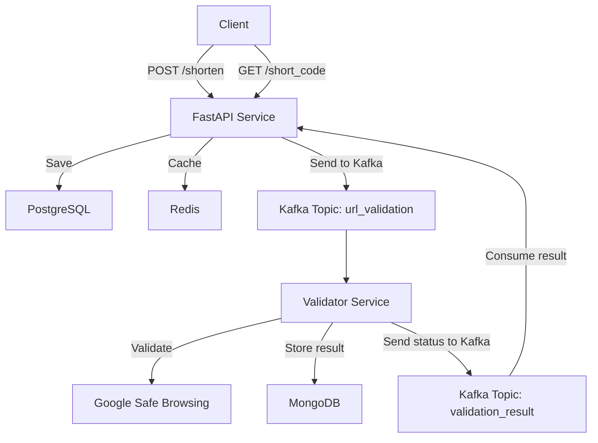

# 🔗 URL Shortener with Asynchronous URL Validation

This project is a modern microservice-based URL shortening platform. It supports asynchronous URL safety validation using Kafka and Google Safe Browsing. Built with FastAPI, PostgreSQL, Redis, Kafka, and MongoDB, the system is deployable via Docker and Kubernetes.

---

## 🚀 Features

- Generate short URLs from long ones.
- Redirect users using short links.
- Track click statistics.
- Asynchronously validate URLs with Google Safe Browsing via Kafka.
- Mark suspicious URLs as inactive until verified.

---

### 🗺️ System Architecture



---

## 🧰 Tech Stack

| Layer         | Tech Stack                                                                 |
|--------------|-----------------------------------------------------------------------------|
| Backend       | [FastAPI](https://fastapi.tiangolo.com/), [SQLAlchemy](https://sqlalchemy.org/), [Pydantic](https://docs.pydantic.dev/) |
| Databases     | [PostgreSQL](https://www.postgresql.org/), [Redis](https://redis.io/), [MongoDB](https://www.mongodb.com/) |
| Messaging     | [Kafka](https://kafka.apache.org/)                                          |
| DevOps        | [Docker](https://www.docker.com/), [Kubernetes](https://kubernetes.io/)     |
| CI/CD         | GitHub Actions *(planned)*                                                  |
| Frontend      | React *(planned)*                                                           |

---

## 🧂 Project Structure

```
url-shortener/
├── backend/
│   ├── shared_models/         # Shared Pydantic schemas
│   ├── shortener_service/     # Main FastAPI app
│   └── url-validator/         # Microservice for URL validation
├── docker/
│   ├── docker-compose.base.yml
│   ├── docker-compose.kafka.yml
│   ├── docker-compose.mongoDB.yml
│   ├── docker-compose.postgres.yml
│   ├── docker-compose.redis.yml
│   └── docker-compose.services.yml
│
├── frontend/                  # (Planned) React frontend
├── k8s/                       # Kubernetes manifests
│   ├── shortener/
│   │   ├── configmap.yaml
│   │   ├── deployment.yaml
│   │   ├── secret.yaml
│   │   ├── secret.yaml.example
│   │   └── service.yaml
│   └── url-validator/
│       ├── configmap.yaml
│       ├── deployment.yaml
│       ├── secret.yaml
│       └── secret.yaml.example
├── Makefile
└── README.md
```

---

## 🔐 Configuration & Secrets

### Local Development

Use `.env.example` files per service:

```bash
cp .env.example .env  # then edit with your local credentials
```

### Kubernetes Secrets

Secrets are defined in `secret.yaml.example` files. Copy and fill real values:

```bash
cp k8s/shortener/secret.yaml.example k8s/shortener/secret.yaml
kubectl apply -f k8s/shortener/secret.yaml
```

Repeat for other services as needed.

---

## ☸️ Kubernetes Deployment

```bash
# Shortener Service
kubectl apply -f k8s/shortener/configmap.yaml
kubectl apply -f k8s/shortener/secret.yaml
kubectl apply -f k8s/shortener/deployment.yaml
kubectl apply -f k8s/shortener/service.yaml

# URL Validator
kubectl apply -f k8s/url-validator/configmap.yaml
kubectl apply -f k8s/url-validator/secret.yaml
kubectl apply -f k8s/url-validator/deployment.yaml
```

### Access the API

- NodePort: `http://localhost:30080/api/v1`
- Ingress (optional): `http://shortener.local/api/v1`

### Cleanup

```bash
kubectl delete -f k8s/
```

---

## 🧪 API Usage

### POST /shorten/

```json
{ "long_url": "https://example.com" }
```

→ Response:

```json
{ "short_url": "http://localhost:30080/go/abc123" }
```

### GET /go/{short_code} → Redirect

### GET /stats/{short_code}

```json
{
  "short_code": "abc123",
  "clicks": 42
}
```

---

## 🔁 URL Validation Lifecycle

1. Shorten URL → stored with status `PENDING`
2. Kafka → `url_validation_requests`
3. Validator:
   - uses Google Safe Browsing
   - stores result in MongoDB
   - publishes result to Kafka
4. Main service consumes it → updates DB

| Status     | Meaning                        |
|------------|--------------------------------|
| `PENDING`  | Awaiting validation            |
| `VALID`    | Confirmed safe                 |
| `INVALID`  | Found malicious/suspicious     |

---

## ⚙️ Makefile Commands

```bash
make build-all         # Build Docker images
make push-all          # Push images to registry
make restart-services  # Restart stack via docker-compose
make deploy-shortener  # Apply shortener to Kubernetes
make deploy-validator  # Apply validator to Kubernetes
```

---

## ✅ Project Status

- ✅ Backend, Kafka, Redis, Mongo — working
- ✅ URL validation pipeline — done
- ⚙️ CI/CD, Frontend — coming soon

---

## 💡 Inspiration

A practical, scalable example of microservices, asynchronous architecture, and event-driven pipelines in Python. Great for learning, demonstrating dev skills, or extending into real products.